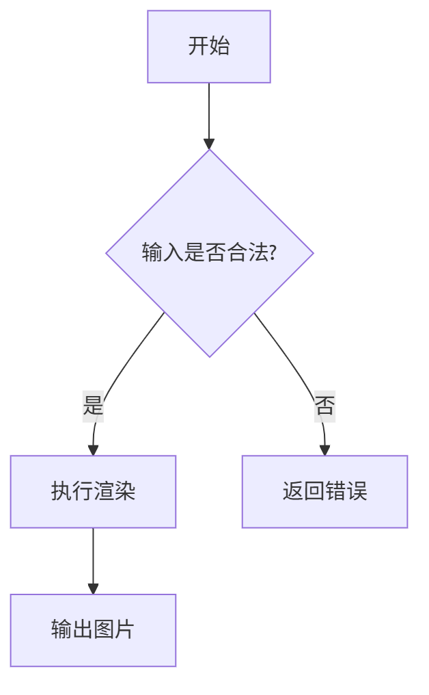
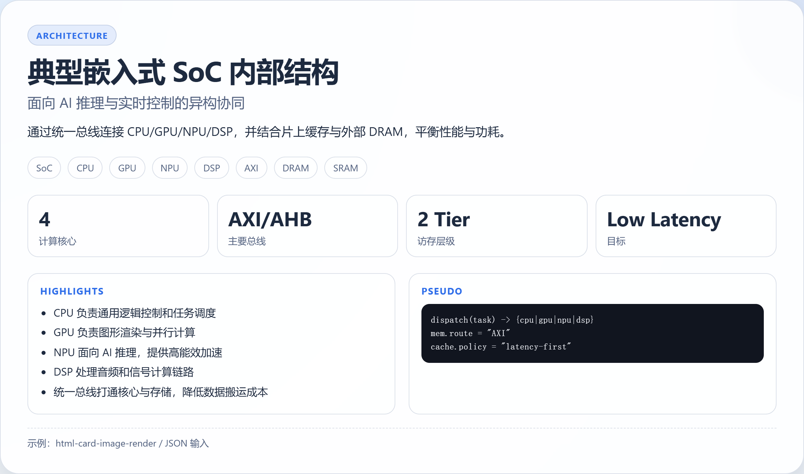

# lbbit_skills

这个仓库用于集中维护可复用的 skills。每个 skill 独立放在一个子目录中。

## Skills 总览

> 维护规则：后续每新增一个 skill，都必须同步更新下表。

| Emoji | 名称 | 一句话简介 |
|---|---|---|
| 🖼️ | [keyword-index-image-download](keyword-index-image-download) | 使用关键词(keyword) + 序号(index)下载单张图片到本地，适用于配图抓取和自动化素材生成。 |
| 📊 | [mermaid-markdown-image-render](mermaid-markdown-image-render) | 基于 Mermaid + Markdown(JavaScript) 将流程图、时序图、状态转移图等渲染为 PNG/SVG/PDF 图片。 |
| 🧩 | [html-card-image-render](html-card-image-render) | 将 HTML/JSON/Markdown/TXT 渲染为高质量卡片图片，适用于 PPT 架构图、数据看板、代码讲解等视觉化场景。 |

## 典型图片生成用法（简洁示例）

### 1) keyword-index-image-download：按关键词下载一张配图

```powershell
python keyword-index-image-download/scripts/download_baidu_image.py --keyword "猫咪" --index 0 --output-dir "./keyword-index-image-download/verify_images"
```

示例图片：


### 2) mermaid-markdown-image-render：把 Mermaid 转为图

```powershell
cd mermaid-markdown-image-render
npm run test:render
```

示例图片：



### 3) html-card-image-render：把结构化内容转为高级卡片图

```powershell
cd html-card-image-render
npm run test:render:json
```

示例图片：



说明：以上命令均会在各自目录下生成图片文件，可直接用于 PPT、文档或文章配图。

## 维护约定

1. 新增 skill 时，创建同名子目录，并包含 SKILL.md。
2. 新增 skill 后，必须在本 README 的 Skills 总览表中新增一行。
3. 表格中的“名称”应与目录名保持一致。
4. “一句话简介”尽量简短，直接说明核心能力。
