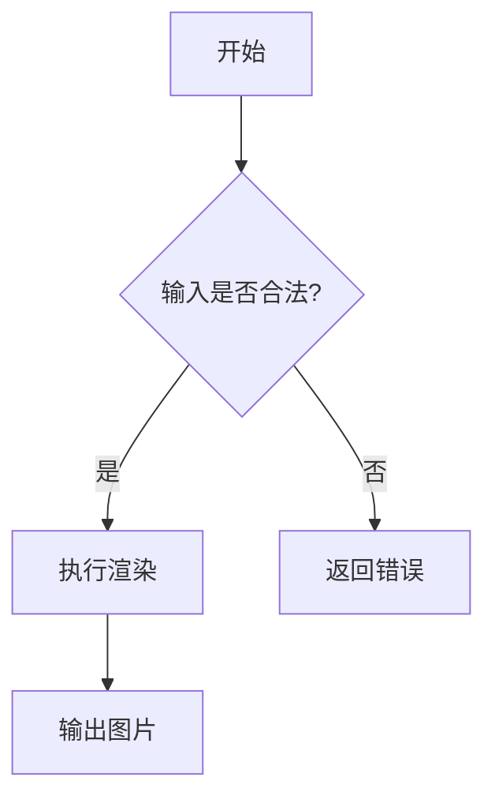
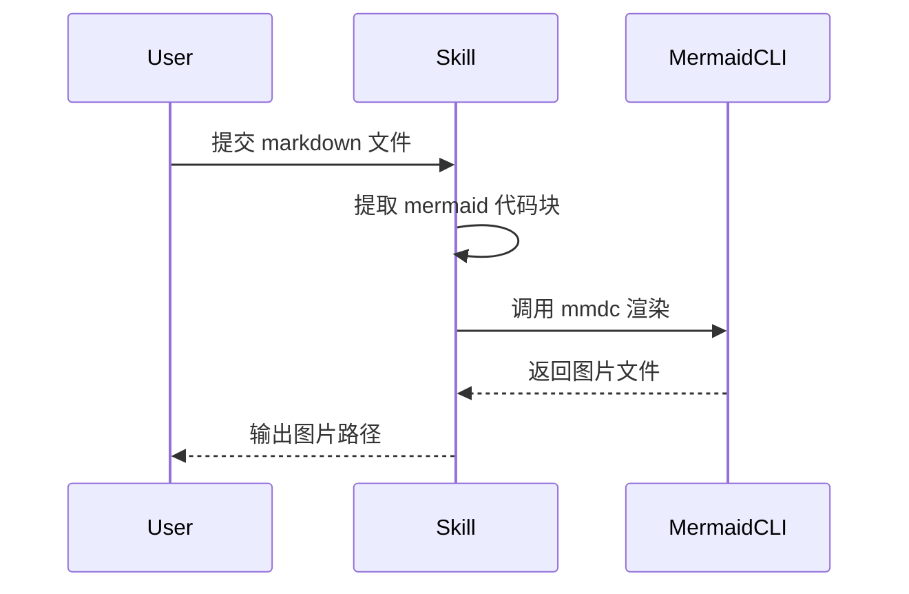
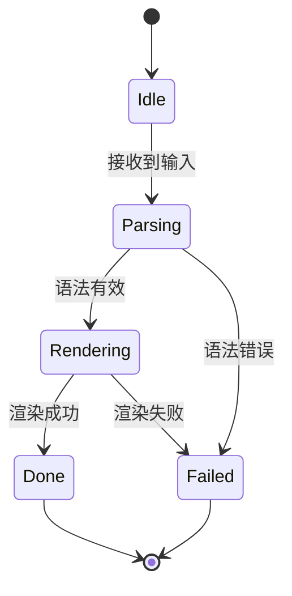

# Mermaid 图表示例

## 流程图

```mermaid
flowchart TD
    A[开始] --> B{输入是否合法?}
    B -- 是 --> C[执行渲染]
    B -- 否 --> D[返回错误]
    C --> E[输出图片]
```

## 时序图

```mermaid
sequenceDiagram
    participant U as User
    participant S as Skill
    participant C as MermaidCLI

    U->>S: 提交 markdown 文件
    S->>S: 提取 mermaid 代码块
    S->>C: 调用 mmdc 渲染
    C-->>S: 返回图片文件
    S-->>U: 输出图片路径
```

## 状态转移图

```mermaid
stateDiagram-v2
    [*] --> Idle
    Idle --> Parsing: 接收到输入
    Parsing --> Rendering: 语法有效
    Parsing --> Failed: 语法错误
    Rendering --> Done: 渲染成功
    Rendering --> Failed: 渲染失败
    Done --> [*]
    Failed --> [*]
```
